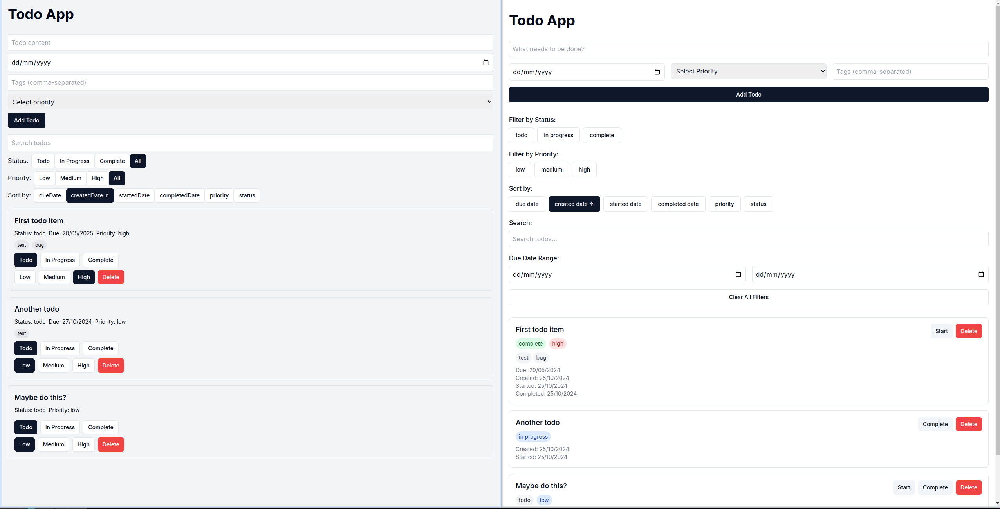

Anthropic have just released their latest model, confusing still called sonnet-3.5 (or technically `claude-3-5-sonnet-20241022`), we'll call it new sonnet.
This model seems to have had quite a major update to it's coding abilities, so lets see how it compares on our react-todo apps.

<!-- truncate -->

## Basic Todo

See [Introducing React Todo](/blog/introducing-react-todo) for the prompt.

##### Old Sonnet

* [Generated Code](https://github.com/autocode2/example-todo/commit/42a36d5dd5c064ad0b7af480d4d6f4c70ae0e715)
* [View the App](https://autocode2.github.io/autocode-examples/examples/example-todo/blog/2024-08-01-introducing-react-todo/typescript_nextjs_shadcn/sonnet)

##### New Sonnet

* [Generated Code](https://github.com/autocode2/example-todo/commit/746b5aaf3744f546ff0c8c7a992cda5d2d6cbaf4)
* [View the App](https://autocode2.github.io/autocode-examples/examples/example-todo/blog/2024-10-24-new-sonnet/basic/sonnet-v2)

A nice design improvement. New sonnet has also generated simpler code with a single file implementation.

## Fully Featured Todo

See [Todo with more features](/blog/todo-with-more-features) for the prompt.

##### New Sonnet

* [Generated Code](https://github.com/autocode2/example-todo/commit/ef91a71575464dae7d2b64dcd141fe90d6e6db41)
* [View the App](https://autocode2.github.io/autocode-examples/examples/example-todo/blog/2024-10-24-new-sonnet/fully-featured/sonnet-v2)

##### Old Sonnet

* [View the App](https://autocode2.github.io/autocode-examples/examples/example-todo/blog/2024-08-14-todo-with-more-features/typescript_nextjs_shadcn/sonnet)
* [Generated Code](https://github.com/autocode2/example-todo/commit/0057b0233f4042afebd4de82838a7d61552d13e1)

Again a significant design improvement. Also the new sonnet doesn't introduce the same type error we had with old sonnet.  The code is fairly closely matched, though the new sonnet extracts the sort and filter logic out into `lib/todoUtils.ts`.

# Conclusion

Fairly terrible UI has been the hallmark of the all the models tested so far. The new sonnet is a welcome improvement in this regard, and obviously for Anthropic it makes artifacts a lot more usable.

