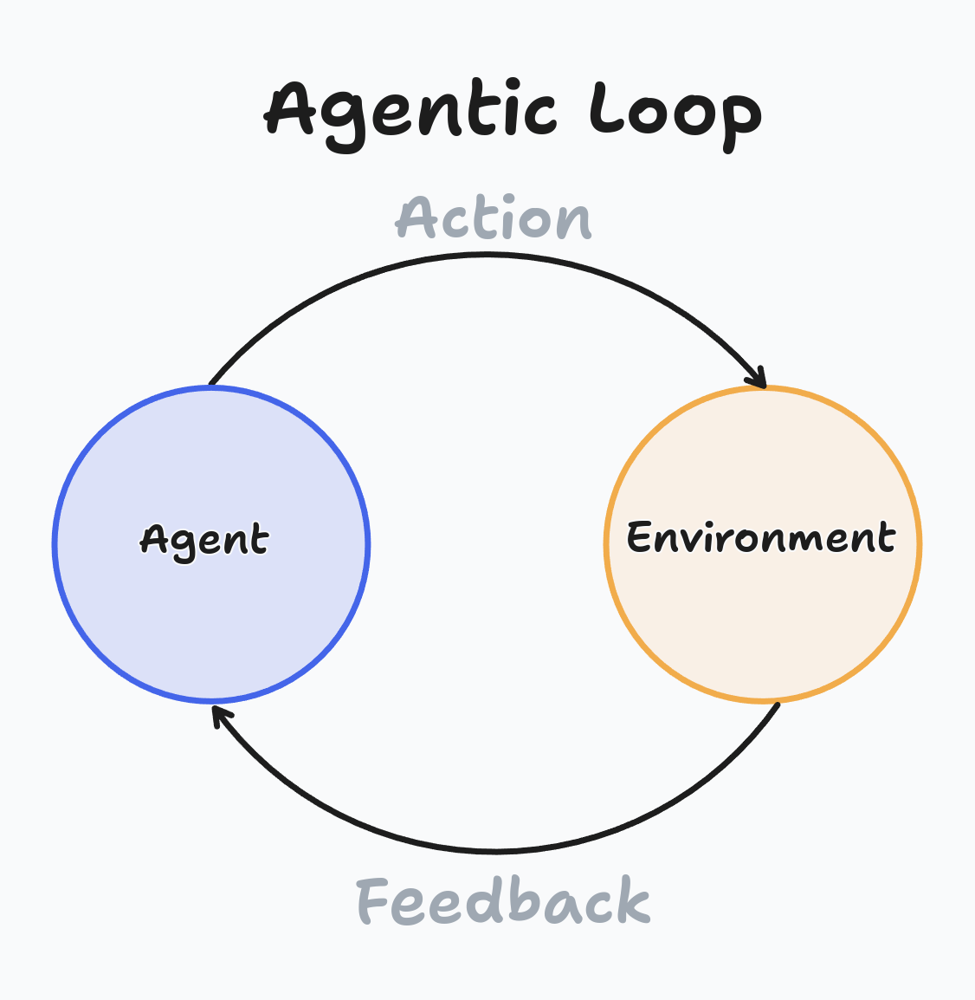
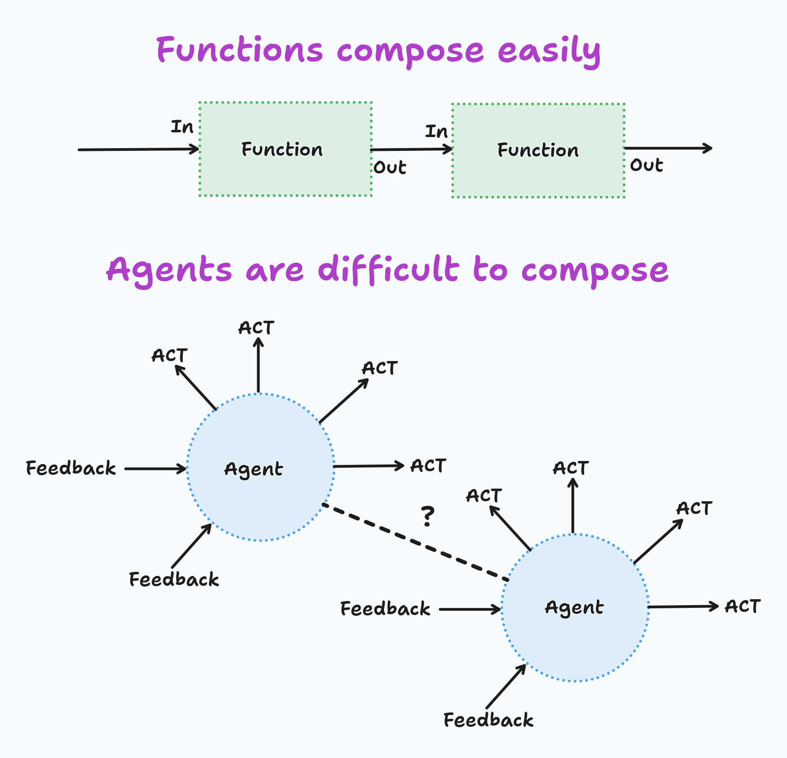
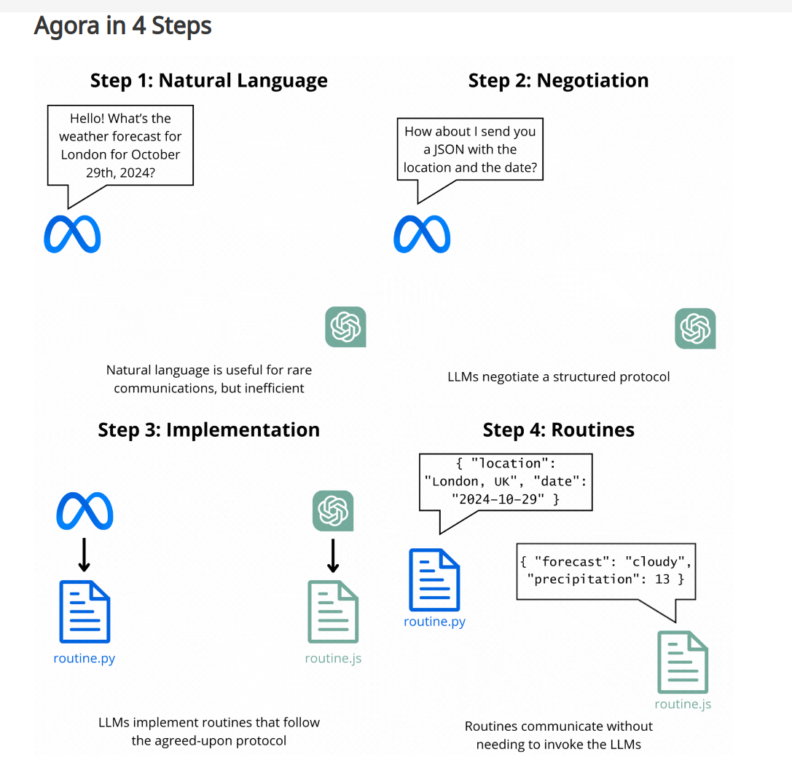

import { Tweet } from 'react-tweet'

Simon Willison is fond of asking the question "What is an agent?", it appears that there are many possible definitions of what an agent is.  Does this make the term pointless?

<!-- truncate -->

<Tweet id="1843290729260703801" />

## Agents in general

Russell and Norvig define an agent as *"anything that can be viewed as perceiving its environment through sensors and acting upon that environment through effectors"*.  This definition is intentionally broad, R&N were attempting to define AI as a field of study and viewed it as synonymous with the study of agents.

R&N also go on to define *goal directed agents*, which are agents that are given goals to work towards rather than procedures for performing a task.  Prompting with LLMs is almost always goal-directed, we specify to the LLM what we want it to do, not how to do it.

## Environments

The most important take-away from the R&N definition is that agents are defined in terms of their *environment*.  LLM agents may have quite trivial environments, a simple chatbot can be consider an agent, but the only means the agent has of affecting its environment is through text responses to a human, and similarly the only feedback it receives is from the human responses.

They key to having useful agents, is in providing rich environments to the agents. [Shunyu Yao](https://www.latent.space/p/shunyu) made this point very well on the latent.space podcast.

## Agentic Systems

Another term du jour is *agentic*.  I really like this term as a relative adjective, a software system can be more or less agentic.  Harrison Chase (Founder of LangChain etc) replied to Simon's tweet "The more agentic an application is, the more an LLM decides the control flow of the application".

<Tweet id="1843292549521473957" />

This term is useful when thinking about implementations of an LLM-based system. For a given task there is usually a spectrum of possible implementations, ranging from a heavily engineered system where the LLM is used for small fixed tasks (as a function), to a fully agentic system where the LLM is equipped with an environment that allows the task to be completed in a completely goal-directed manner.

For instance, RAG can be broadly split into non-agentic RAG where the retrieval is performed by software and then provided to the LLM as context, and agentic-RAG where the LLM is provided with tools and performs its own retrieval.

I recommend Travis Fisher's blog post on the [Agentic Spectrum](https://transitivebullsh.it/agentic-spectrum) for more on the idea of agentic as a relative term.

## Agentic Loop

A term that I have been using is the **agentic loop**.  This is any loop of the form Act (on the environment) -> Feedback (from the environment) -> (Re)Act  The standard tool-usage loop is an example of an agentic loop.
Libraries like LangGraph are designed to make implementing agentic loops easier.

# Composition of Agents

Now down to my current working definition of an Agent

> **An agent is a software component that composes like an agent**

This definition is interesting to me because it defines an agent in terms of how it looks from the outside, rather than the definition of "agentic" which is defined in terms of how the system is implemented.

First, lets step back and consider what "composition" means. In this context, we're just referring to the process where a (software) system is built from smaller components.  This happens at all scales, from the composition of functions to make new functions, up to the Internet itself which is an extremely complex composition of many different components.

At the smallest scale, it's interesting to think about how agentic building blocks can be composed.  The easiest thing to do is to treat an LLM call like a function.  We know how to compose functions, and we can easily compose LLM-based functions with ordinary software functions so this a productive mode of development and has been the dominant mode in these early years of the LLM-era.  The presence of agentic loops doesn't fundamentally change this mode of composition, we can wrap the agentic parts of the system so that they appear to the rest of the system as a function.

However, there are more agentic methods of composition.  For instance, we can compose conversational agents by simply allowing them to talk to each other.  This brings a very different range of patterns than software developers are used to, often with ideas from  how humans are composed to work towards goals (teams, supervisors, specialists etc), and a new set of changes

We can also think about the composition of larger agentic systems. Anthropic's MCP provide's a good example of this.  The Claude desktop agent can now interface with other agentic software, for example cursor, we could imagine a scenarios where I'm using the composer agent in cursor, and I need to give the cursor agent some info I read in a blog post that I bookmarked.  Perhaps the cursor agent could communicate with claude, which may in turn invoke a google chrome agent that can search my bookmarks, and in a goal-directed manner they co-operate to perform the task.

A final thing to think about in agentic composition, is that through LLMs code writing abilities it is possible for LLMs to build their own glue code to facilitate integration with other systems/agents.  A great example of this (and perhaps my favourite paper of the year) is the [Agora Protocol](https://agoraprotocol.org/)

