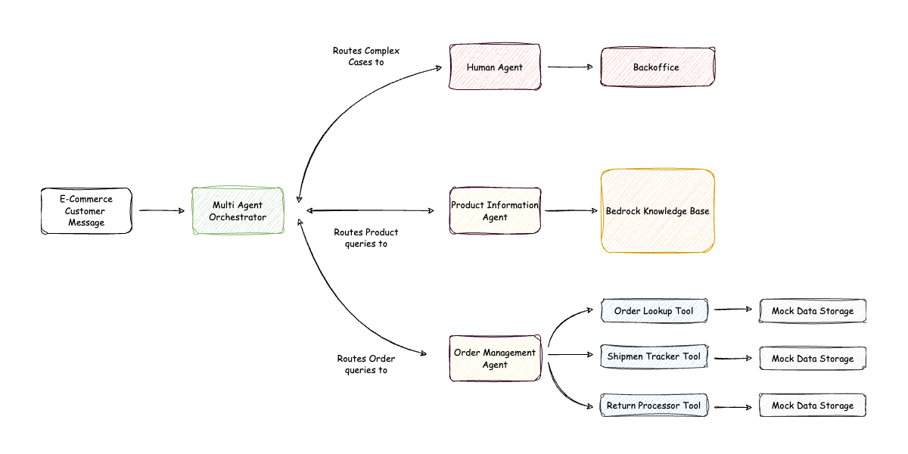
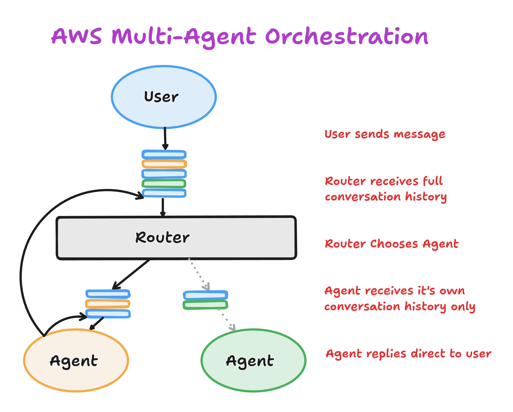

AWS Labs have released a [Multi-Agent Orchestrator Framework](https://awslabs.github.io/multi-agent-orchestrator/) which they bill as a

> Flexible and powerful framework for managing multiple AI agents and handling complex conversations.

It's implemented in python and typescript so lets take a look and see what it does.

(TL;DR The whole framework can be reduced to a single classification prompt and a bit of supporting machinery).

<!-- truncate -->

## Intro

This library is fairly squarely aimed at AWS Solutions Architects etc.  It provides a full framework for building AI applications, and seems fairly well suited to building customer support agents etc, with a heavy focus on AWS products:
- Bedrock for LLM models
- Bedrock Knowledge Base - for semantic search
- DynamoDB - for conversational storage.
- Lambda
- Amazon Lex

Their e-commerce customer support agent example is a good example of the kind of thing you might build with this library.


It's unfortunate they felt they needed to reinvent the wheel here. It obscures the useful part of the library, which is just a simple multi-agent conversation router.

## Multi-Agent Orchestration

So what do the author's mean by "Multi-Agent Orchestration"?  It turns out they implement a single simple pattern we'll refer to as the *Router* pattern.



The router is just a simple classifier. Given a description of each of the agents, and the full conversation history it must decide which agent to send the latest message to.

Each agent has a local conversation history which only contains the messages it's received and the responses it's sent.  When the selected agent generates a response this is sent straight back to the user, the router is only involved in selecting the agent.

## Prompt

The classifier is implemented as a single prompt.

<pre style={{whiteSpace: 'pre-line'}}>
{`
You are AgentMatcher, an intelligent assistant designed to analyze user queries and match them with the most suitable agent or department. Your task is to understand the user's request, identify key entities and intents, and determine which agent or department would be best equipped to handle the query.

Important: The user's input may be a follow-up response to a previous interaction. The conversation history, including the name of the previously selected agent, is provided. If the user's input appears to be a continuation of the previous conversation (e.g., "yes", "ok", "I want to know more", "1"), select the same agent as before.

Analyze the user's input and categorize it into one of the following agent types:
<agents>
{{AGENT_DESCRIPTIONS}}
</agents>
If you are unable to select an agent put "unkwnown"


Guidelines for classification:

    Agent Type: Choose the most appropriate agent type based on the nature of the query. For follow-up responses, use the same agent type as the previous interaction.
    Priority: Assign based on urgency and impact.
        High: Issues affecting service, billing problems, or urgent technical issues
        Medium: Non-urgent product inquiries, sales questions
        Low: General information requests, feedback
    Key Entities: Extract important nouns, product names, or specific issues mentioned. For follow-up responses, include relevant entities from the previous interaction if applicable.
    For follow-ups, relate the intent to the ongoing conversation.
    Confidence: Indicate how confident you are in the classification.
        High: Clear, straightforward requests or clear follow-ups
        Medium: Requests with some ambiguity but likely classification
        Low: Vague or multi-faceted requests that could fit multiple categories
    Is Followup: Indicate whether the input is a follow-up to a previous interaction.

Handle variations in user input, including different phrasings, synonyms, and potential spelling errors. For short responses like "yes", "ok", "I want to know more", or numerical answers, treat them as follow-ups and maintain the previous agent selection.

Here is the conversation history that you need to take into account before answering:
<history>
{{HISTORY}}
</history>

Examples:

1. Initial query with no context:
User: "What are the symptoms of the flu?"

userinput: What are the symptoms of the flu?
selected_agent: agent-name
confidence: 0.95

2. Context switching example between a TechAgentand a BillingAgent:
Previous conversation:
User: "How do I set up a wireless printer?"
Assistant: [agent-a]: To set up a wireless printer, follow these steps: 1. Ensure your printer is Wi-Fi capable. 2. Connect the printer to your Wi-Fi network. 3. Install the printer software on your computer. 4. Add the printer to your computer's list of available printers. Do you need more detailed instructions for any of these steps?
User: "Actually, I need to know about my account balance"

userinput: Actually, I need to know about my account balance</userinput>
selected_agent: agent-name
confidence: 0.9


3. Follow-up query example for the same agent:
Previous conversation:
User: "What's the best way to lose weight?"
Assistant: [agent-name-1]: The best way to lose weight typically involves a combination of a balanced diet and regular exercise. It's important to create a calorie deficit while ensuring you're getting proper nutrition. Would you like some specific tips on diet or exercise?
User: "Yes, please give me some diet tips"

userinput: Yes, please give me some diet tips
selected_agent: agent-name-1
confidence: 0.95


4. Multiple context switches with final follow-up:
Conversation history:
User: "How much does your premium plan cost?"
Assistant: [agent-name-a]: Our premium plan is priced at $49.99 per month. This includes features such as unlimited storage, priority customer support, and access to exclusive content. Would you like me to go over the benefits in more detail?
User: "No thanks. Can you tell me about your refund policy?"
Assistant: [agent-name-b]: Certainly! Our refund policy allows for a full refund within 30 days of purchase if you're not satisfied with our service. After 30 days, refunds are prorated based on the remaining time in your billing cycle. Is there a specific concern you have about our service?
User: "I'm having trouble accessing my account"
Assistant: [agenc-name-c]: I'm sorry to hear you're having trouble accessing your account. Let's try to resolve this issue. Can you tell me what specific error message or problem you're encountering when trying to log in?
User: "It says my password is incorrect, but I'm sure it's right"

userinput: It says my password is incorrect, but I'm sure it's right
selected_agent: agent-name-c
confidence: 0.9

Skip any preamble and provide only the response in the specified format.
`}
</pre>

Seems like a fairly standard prompt:
- the task is well defined (except for the "unkwnown" typo)
- they've delimited the inputs well (with xml tags, which works particularly well with the Anthropic models - and Claude Sonnet is the default)
- they provide few-shot examples. Though they don't provide agent descriptions in the examples so it's not clear how much extra information is available to the model.
- They also provide a tool definition to the model to obtain structured output.

```javascript
    {
      name: 'analyzePrompt',
      description: 'Analyze the user input and provide structured output',
      input_schema: {
        type: 'object',
        properties: {
          userinput: {
            type: 'string',
            description: 'The original user input',
          },
          selected_agent: {
            type: 'string',
            description: 'The name of the selected agent',
          },
          confidence: {
            type: 'number',
            description: 'Confidence level between 0 and 1',
          },
        },
        required: ['userinput', 'selected_agent', 'confidence'],
      },
    },
```

## Review and Conclusion

The Multi-Agent Orchestrator boils down to a single prompt and quite a restrictive model of multi-agent interaction.  This seems likely to only work with small numbers of agents with completely distinct responsibilities such that no coordination between agents is required.

A similar pattern is the "Supervisor" pattern.  However in this case the supervisor is much more than just a classifier. It is often implemented agentically and is responsible for co-ordinating the sub-agents to provide the information required for the supervisor to then respond to the user. This pattern seems much more flexible for most use-cases and can be engineered to be little more than a router if that is all the situation requires.
