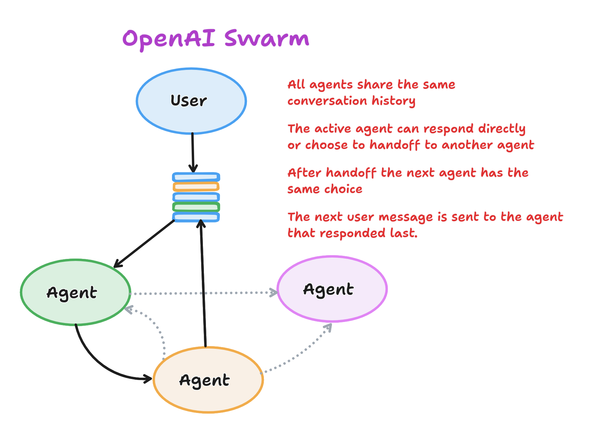
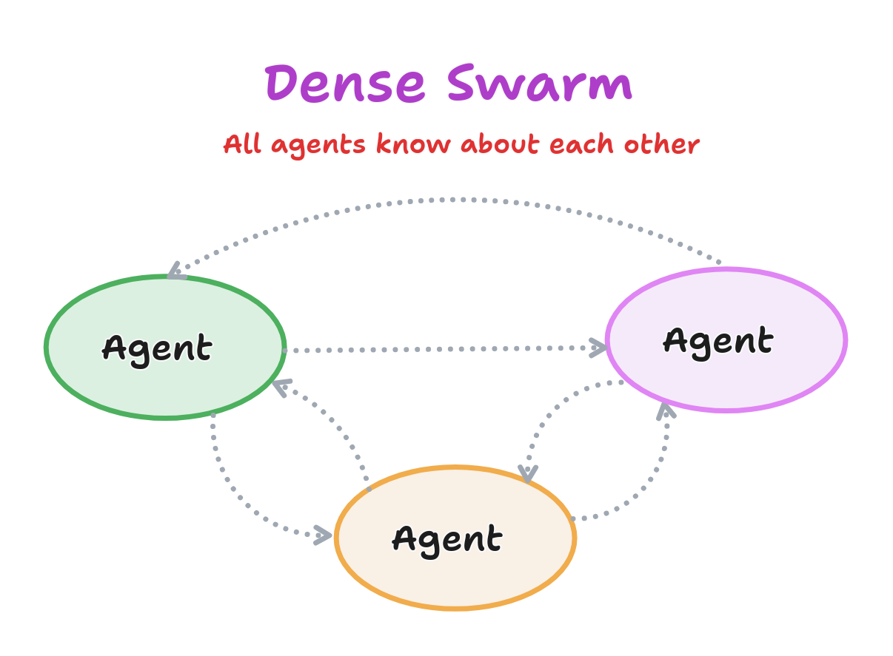
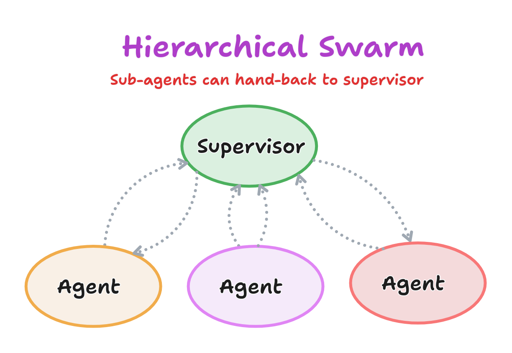
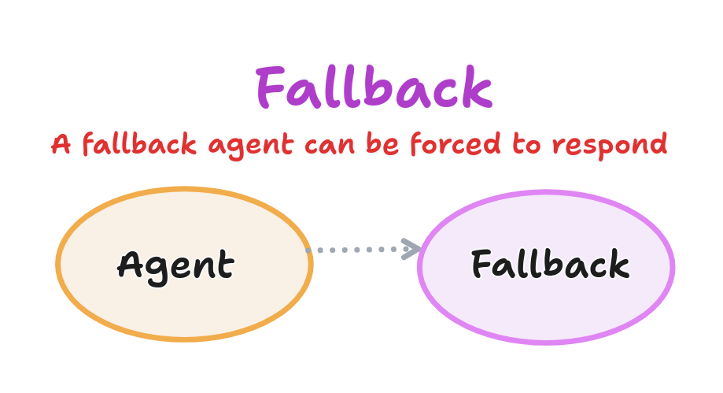
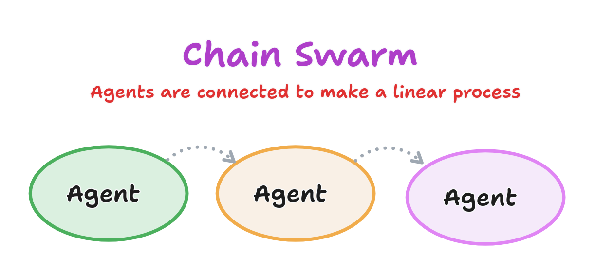

OpenAI released [Swarm](https://github.com/openai/swarm/):

> An educational framework exploring ergonomic, lightweight multi-agent orchestration.

It's implemented in Python, but there's a TypeScript version [SwarmJS](https://github.com/youseai/openai-swarm-node), and the concepts are simple enough to implement anywhere.

<!-- truncate -->

## The Handoff Pattern

The library is really just a simple demonstration of the *Handoff* pattern.  The idea is that you have a bunch of agents, any one of which is active at any time. When a new message arrives the active agent can respond or hand off to another agent (the handoff is implemented as a tool call).  After a handoff, the new agent becomes active and can respond to the user.  All the agents share the same message history.

Despite the simplicity of the pattern, there is still quite a lot of flexibility in how the agents are arranged.

## Examples

### Dense

This is the simplest arrangement: every agent knows about every other agent.  For small numbers of agents, this seems like a good choice but it doesn't scale well.

### Hierarchical / Supervisor

Here we have a designated supervisor agent that can hand off to a number of specialist agents.  Each of the specialists can then hand back to the supervisor.  Note the pattern allows for multiple handoffs to occur before the message is responded to.

Swarm includes an example of a *Triage Agent* connected to a *Sales Agent* and a *Refunds Agent* using this pattern.  They also demonstrate this pattern in an Airline customer service example, where specialist agents can transfer to their own sub-specialists.

### Fallback

A simple use for handoffs is to implement a "fallback" agent.  If the active agent can't respond to a message, it can hand off to the fallback agent.  The fallback agent isn't allowed to hand off to any other agent, so it must respond to the user.  For example, this could be an agent designed to create a customer support ticket if the other agents were not able to handle a requirement.

### Chain

Handoffs can also be used to implement a linear chain of agents, where each agent hands off to the next in sequence.  For example, we could imagine a coding workflow where we first wanted to brainstorm and plan with an agent, then write the code, and then write and update the tests.  Our conversation would start with the planning agent and then when we indicate we're ready ("Plans look good, let's code!") the planning agent can hand off to the code agent. After the code agent is finished, it transfers to the test agent.

## Conclusion

Swarm is simple enough that you might be better off implementing it yourself than to use the library.  However, the Handoff pattern is a flexible and powerful way to manage multi-agent conversations.  It's a good pattern to have in your toolbox.
